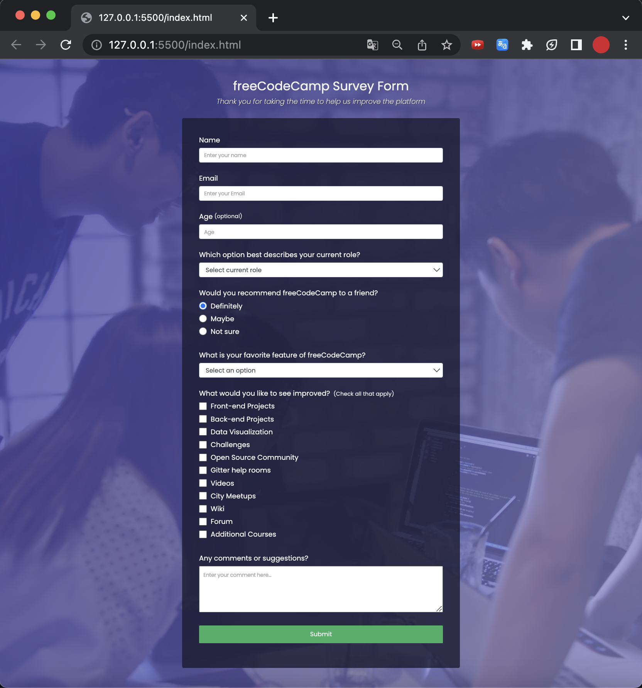

<h2>Survey Form</h2>

User Stories:
<h4>1</h4>
You should have a page title in an h1 element with an id of title
<h4>2</h4>
You should have a short explanation in a p element with an id of description
<h4>3</h4>
You should have a form element with an id of survey-form
<h4>4</h4>
Inside the form element, you are required to enter your name in an input field that has an id of name and a type of text
<h4>5</h4>
Inside the form element, you are required to enter your email in an input field that has an id of email
<h4>6</h4>
If you enter an email that is not formatted correctly, you will see an HTML5 validation error
<h4>7</h4>
Inside the form, you can enter a number in an input field that has an id of number
<h4>8</h4>
The number input should not accept non-numbers, either by preventing you from typing them or by showing an HTML5 validation error (depending on your browser).
<h4>9</h4>
If you enter numbers outside the range of the number input, which are defined by the min and max attributes, you will see an HTML5 validation error
<h4>10</h4>
For the name, email, and number input fields, you can see corresponding label elements in the form, that describe the purpose of each field with the following ids: id="name-label", id="email-label", and id="number-label"
<h4>11</h4>
For the name, email, and number input fields, you can see placeholder text that gives a description or instructions for each field
<h4>12</h4>
Inside the form element, you should have a select dropdown element with an id of dropdown and at least two options to choose from
<h4>13</h4>
Inside the form element, you can select an option from a group of at least two radio buttons that are grouped using the name attribute
<h4>14</h4>
Inside the form element, you can select several fields from a series of checkboxes, each of which must have a value attribute
<h4>15</h4>
Inside the form element, you are presented with a textarea for additional comments
<h4>16</h4>
Inside the form element, you are presented with a button with id of submit to submit all the inputs
<h4>17</h4>
Fulfill the user stories and pass all the tests below to complete this project. Give it your own personal style. Happy Coding!

Note: Be sure to add <link rel="stylesheet" href="styles.css"> in your HTML to link your stylesheet and apply your CSS

Well done! You have completed the final part of the Registration Form practice project.

End.
